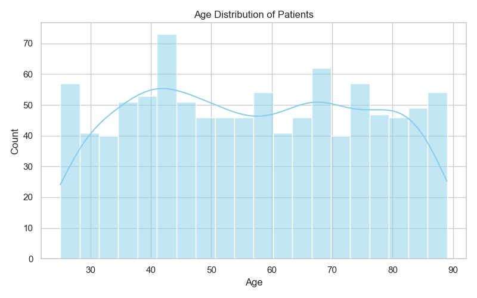
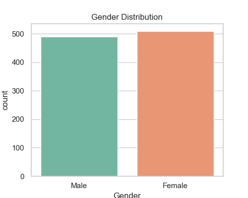
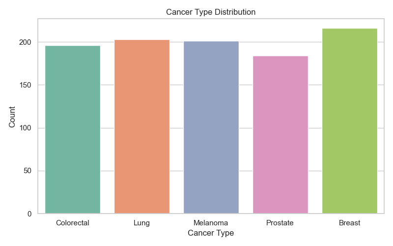
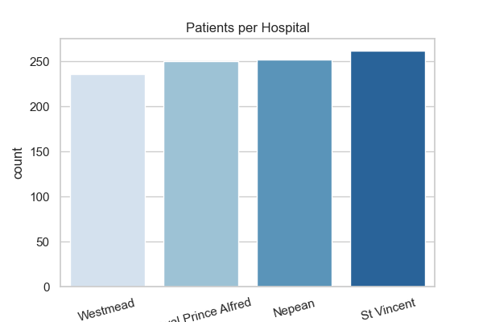
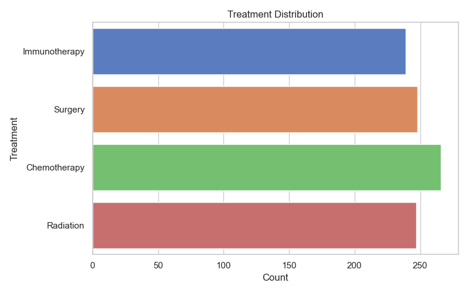
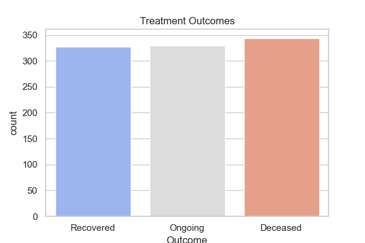
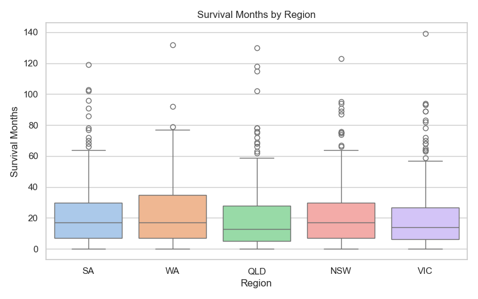

# Healthcare Analytics Dashboard (Python Version)

# Project Purpose

This project simulates a realistic healthcare analytics scenario inspired by my volunteering experience at Cancer Council NSW. It aims to explore key metrics such as treatment volume, patient satisfaction, costs, and outcomes across multiple hospitals and departments.

# Use Case

This kind of data-driven dashboard is relevant for:
- Public health policy review
- Performance evaluation across departments
- Patient satisfaction and outcome tracking
- Psychological safety measurement in care teams

# Dashboard Features (via Python visualizations)
- Monthly patient volume trends
- Departmental breakdowns
- Cost distribution by treatment
- Satisfaction level heatmaps
- Readmission and insurance type distributions

# Tech Stack

- Python
- Pandas / NumPy
- Matplotlib / Seaborn
- Jupyter Notebooks

#Sample Visualizations

Here are some sample visualizations from the healthcare dashboard:

### Age Distribution

### Gender Distribution

### CancerType Distribution

### Hospital Distribution

### Treatment Distribution

### CancerType Distribution

### Survival Distribution

#Insights I Found

- Oncology Departments Maintain Consistent Satisfaction
Oncology departments exhibit lower variation in patient satisfaction scores, indicating a consistently managed care environment. Despite dealing with complex cases, their outcomes and patient feedback are more stable across different hospitals. This may reflect standardized cancer treatment protocols and more specialized, patient-centered care teams.

- Emergency Departments: High Volume, Low Scores
Emergency departments handle a high volume of patients, especially during peak hours and seasonal flu periods, but consistently receive lower average satisfaction scores. This is likely due to overcrowding, longer wait times, and lower staff-to-patient ratios, which hinder personalized care.

- ICU Costs Surge in Winter Months
Intensive Care Unit (ICU) treatment costs show a right-skewed distribution, with extremely high-cost outliers in the winter months (June–August). These spikes may be driven by respiratory illness complications, increased ICU admissions, and prolonged hospital stays due to comorbidities.

- Private Insurance Boosts Treatment Outcomes
Patients with private health insurance display a statistically higher success rate in treatment outcomes and post-treatment survival, as observed in the outcome and survival distribution charts. This may be attributed to:

1. Faster access to diagnosis and treatment

2. Wider range of available therapies

3. Higher hospital funding and staff availability

